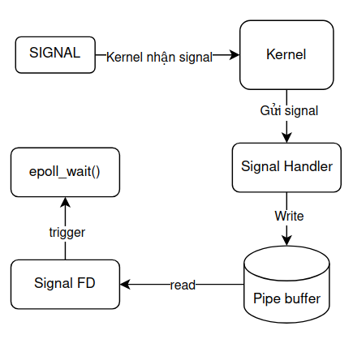
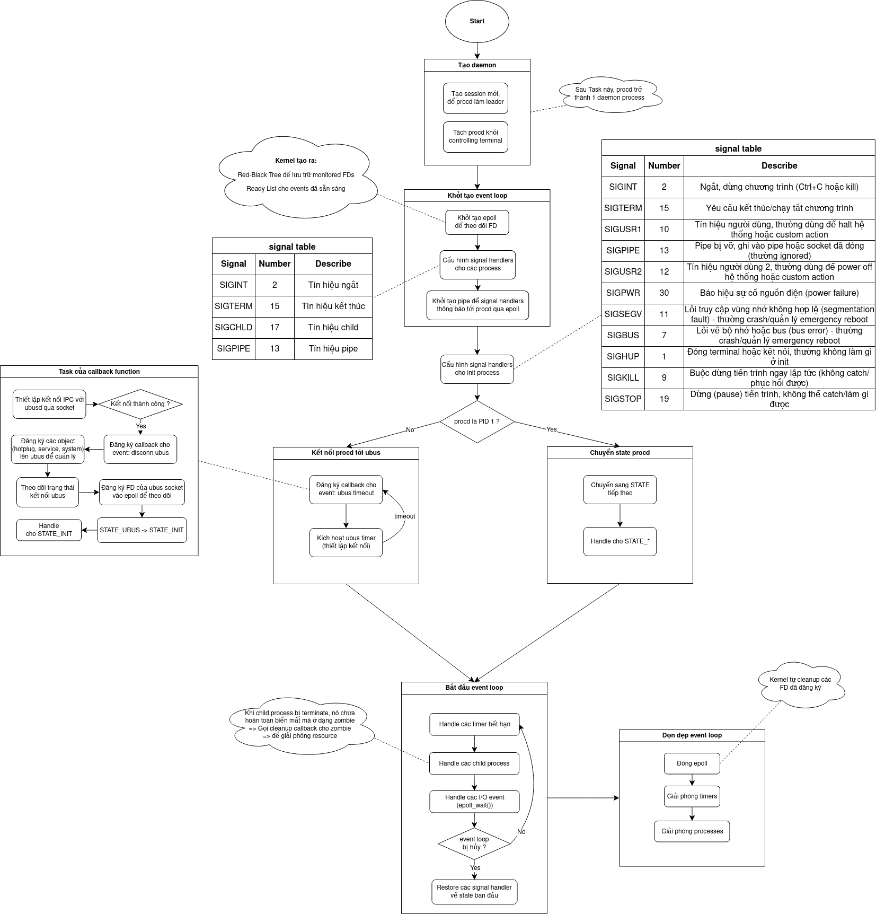
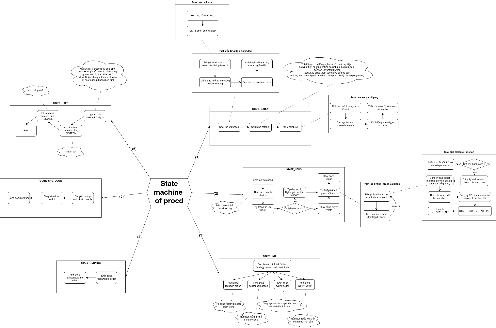
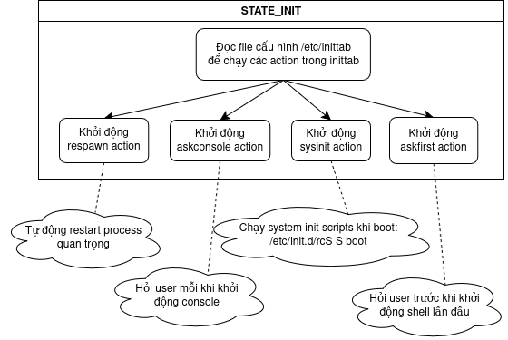
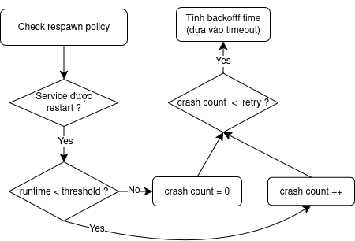

# Understanding about Boot Sequence of OpenWrt system (Behind in the scene)

## 1. Overview
Quá trình boot của OpenWrt tuân theo một luồng có cấu trúc, đảm bảo hệ thống khởi tạo hiệu quả và tin cậy từ kernel đến toàn bộ dịch vụ userspace:
1. **Kernel boot**: Sau khi nạp xong, kernel sẽ tìm kiếm và thực thi tiến trình người dùng đầu tiên, thông thường tại `/init` hoặc `/sbin/init`. Trên hệ thống OpenWrt hiện đại, `/sbin/init` là một symlink trỏ tới `procd`.
2. **Giai đoạn preinit**: Hệ thống sẽ thực thi script preinit (/etc/preinit).
- Giai đoạn này xử lý các nhiệm vụ nền tảng: thiết lập root filesystem, mount overlayfs, kiểm tra hoặc vào failsafe mode nếu phát hiện sự cố hệ thống.
- Đây là bước quan trọng để đảm bảo hệ thống ở trạng thái tối thiểu an toàn trước khi khởi tạo các dịch vụ chính thức.
3. **Chuyển tiếp sang Procd**: Sau khi preinit hoàn thành, `init process` hiện tại sẽ gọi `exec` để thay thế chính nó bằng chương trình `/sbin/procd`. Tại thời điểm này, `procd` đảm nhận vai trò `PID 1` – tiến trình gốc của toàn bộ userspace.
4. **Khởi động procd**: Chương trình của procd sẽ khởi tạo event loop, thiết lập signal handler, và sau cùng là thực thi state machine quản lý process hệ thống.

Procd chịu trách nhiệm monitor và quản lý tất cả các service, xử lý event hệ thống (hotplug, signal, network), cũng như duy trì sự ổn định của hệ thống.

Các dịch vụ/daemons sẽ được procd khởi động lần lượt thông qua các script `/etc/init.d/`, với thứ tự phụ thuộc được xác định qua các symlink trong `/etc/rc.d/`. Cụ thể thực hiện của procd sẽ được trình bày ở phần tiếp theo


## 2. OpenWrt `procd`
OpenWrt (hoặc LEDE) sử dụng `procd` để boot hệ thống, quản lý tiến trình và xử lý các phần tương tác kernel/userland. Dưới đây là danh sách các tác vụ mà `procd` sẽ thực hiện sau khi em trace source code. Trước đấy em có take note 1 số kiến thức trọng tâm em tìm hiểu đính kèm:

### 2.1 Một số kiến thức bổ sung
#### 2.1.1 epoll API
`epoll` API, tương tự như `poll`, phục vụ cho việc giám sát các FD để phát hiện các event nhận được. Khác với `poll` ở chỗ nó không cần duyệt các fd và có thể phát hiện event ngay lập tức => tối ưu hơn. 

Để phát hiện event, kernel sẽ dựa trên 1 cấu trúc dữ liệu trong kernel là **epoll instance** chứa:
1. **Interest list**: tập các FD mà ứng dụng muốn theo dõi (thêm bằng `epoll_ctl()`).
2. **Ready list**: tập các FD đã có event sẵn sàng (I/O ready), được kernel cập nhật tự động khi state của FD thay đổi.

**epoll mode**
- **Edge-triggered (EPOLLET)**: Chỉ báo khi có state mới, sau khi `read()` / `write()`, phải tiếp tục đọc/ghi đến EAGAIN để tránh bỏ sót event.
- **Level-triggered (default)**: Báo liên tục nếu event còn state chưa xử lý.

**Sequence Flow**
1. **Tạo epoll instance**: Ứng dụng gọi `epoll_create()` hoặc `epoll_create1()`, kernel cập 1 FD đại diện cho 1 container epoll.
2. **Ứng dụng thêm FD vào Interest list**: Dùng `epoll_ctl()` để đăng ký từng FD kèm kiểu event (write/read/edge-triggered...). Kernel lưu FD vào RB-trê để truy xuất nhanh.
3. **Kernel giám sát state của FD**: Khi FD có dữ liệu đến (hoặc state I/O khác thay đổi), kernel kiểm tra interest list và cập nhật ready list nếu FD phù hợp với điều kiện đã resgister:
    - Nếu FD ở **edge-trigger mode** (`EPOLLET`), chỉ khi có trạng thái mới thì kernel mới chuyển sang ready list (tránh báo lại event cũ).
    - Nếu FD ở **level-trigger mode**, FD vẫn ở ready list đến khi ứng dụng xử lý xong.
4. **Chờ, phát hiện và trả event bằng epoll_wait**: Ứng dụng gọi `epoll_wait()` để lấy các FD có event từ ready list:
    - Nếu chưa có event, thread bị block chờ kernel báo thức khi ready list có FD.
    - Nếu có event, kernel trả về thông tin event (kiểu event, FD) trong `struct epoll_event`.
5. **Xử lý đồng thời và tối ưu "thundering herd"**: Khi nhiều thread/process cùng chờ trên epoll instance, kernel chỉ wakeup số lượng thread vừa đủ khi event xảy ra để tối ưu.
6. **Quản lý xóa/sửa FD**: Nếu FD bị đóng, kernel tự động loại bỏ khỏi interest list của các epoll instances.

Cơ chế `epoll` được thực hiện trong thư viện `libubox/uloop` của OpenWrt. `uloop` là event loop, quản lý tất cả các event bất đồng bộ trong 1 thread duy nhất:
- Nhận, kiểm tra và xử lý các event (timer, file descriptor, process, signal). Không cần polling liên tục, chỉ gọi callback khi có event => tiết kiệm CPU
- Các module (ubus, hotplug, service, watchdog...) chỉ cần đăng ký callback với uloop, uloop sẽ dựa vào từng loại sự kiện để gọi đúng hàm xử lý cho từng module.

#### 2.1.2 Watchdog
Watchdog là bộ đếm thời gian phần cứng đưọc thiết kế để giám sát hoạt động của hệ thống và tự reset lại thiết bị nếu phát hiện có vấn đề. Chính vì thế cần có cơ chế để chứng mình hệ thống còn sống (không reset lại thiết bị) => ping watchdog (ping trước khi watchdog timer -> 0)

Kịch bản bình thường:
```c
while(1) {
    process_network();        // Xử lý mạng
    handle_requests();        // Xử lý request
    watchdog_ping();         // Báo "tôi vẫn ổn" 
    sleep(1000);             // Chờ 1 giây
}
```

#### 2.1.3 Netlink socket
Là 1 loại socket đặc biệt trong Linux dùng cho giao tiếp giữa kernel space và user space (thông qua **protocol number** để định danh socket) để xử lý các loại thông tin khác nhau (network, hotplug, firewall,...) 1 cách realtime. Ưu điểm của Netlink là cơ chế giao tiếp full-duplex (theo lý thuyết thì mạnh hơn thằng `ioctl`):
- Kernel -> User: Tự động thông báo events (hotplug, network, changes...)
- User -> kernel: Request/Response
- Bất đồng bộ (không bị block, real-time)

#### 2.1.4 Hotplug và Coldplug
- Hotplug (sự kiện nóng):
    - Xử lý thiết bị cắm/tháo trong runtime
    - Events xảy ra real-time khi có thay đổi phần cứng
- Coldplug (sự kiện lạnh): 
    - Phát hiện tất cả thiết bị đã có sẵn khi boot
    - Xử lý một lần duy nhất tại thời điểm khởi động

=> Coldplug giống như hotplug được xử lý 1 lần duy nhất các thiết bị (đã tồn tại) được procd phát hiện.

#### 2.1.5 Signal
Signal được gửi process cụ thể. Theo em tìm hiểu thì có 2 thằng có thể xử lý signal nhận được, 1 là kernel thấy signal và xử lý trực tiếp, 2 là kernel gửi signal cho signal handler (mặc định hoặc tự custom) để xử lý. Và dưới đây là cụ thể cho từng signal em thấy liên quan tới boot sequence của procd:
1. `SIGKILL`: Kernel xử lý trực tiếp. Không thể bị handle, block hoặc ignore bởi signal handler và bị kernel kill ngay lập tức.
2. `SIGSTOP`: Kernel xử lý trực tiếp. Không thể bị handle, block hoặc ignore bởi signal handler và bị kernel suspend ngay lập tức (process vào trạng thái STOPPED)
3. `SIGINT`: Kernel phát hiện signal (Ctrl + C) và gửi tới cho signal handler, signal handler sẽ xử lý signal.
4. `SIGTERM`: Kernel gửi từ kill command. Signal handler quyết định có xử lý (terminate) hay không
5. `SIGCHLD`: Kernel gửi khi child process thay đổi state, Signal handler xử lý zombie process.
6. `SIGPIPE`: Kernel phát hiện write to broken pipe và gửi signal cho signal handler. Signal handler quyết định cách xử lý lỗi.
7. `SIGUSR1` và `SIGUSR2`: Kernel chỉ chuyển tiếp signal cho signal handler xử lý.
8. `SIGPSEGV`: Kernel phát hiện memory violation, gửi signal. Mặc định thì kernel sẽ tự terminate nhưng có thể handle bằng signal handler nhưng nguy hiểm.
9. `SIGBUS`: Kernel phát hiện bus error và gửi signal. Mặc định kernel tự terminate nhưng có thể handle bằng signal handler nhưng cũng nguy hiểm.

Dựa trên bối cảnh OpenWrt, và một số kiến thức nêu trên, em có thể vẽ ra Data flow của procd khi nhận được 1 signal như sau:




### 2.2 Data flow của procd
Sau khi trace source code của procd, em có vẽ lại được luồng xử lý của procd chính như sau:




Hoạt động của `procd` được tổ chức như một máy trạng thái hữu hạn được định nghĩa trong các tệp nguồn (đáng chú ý là `/procd/state.c`). Trạng thái `procd` được thay đổi từ trạng thái đầu tiên cho đến trạng thái cuối cùng. Trạng thái hiện tại được đặt trong biến toàn cục state. Trạng thái có thể được thay đổi bằng cách gọi `procd_state_next()`. `procd` bao gồm 6 trạng thái:




## 3. OpenWrt Init System

Giống như nhiều hệ thống dựa trên Linux, OpenWrt sử dụng **hệ thống init** để quản lý việc khởi động, tắt và bảo trì các dịch vụ. Tuy nhiên, thay vì sử dụng các hệ thống phổ biến hơn như `systemd`, OpenWrt dựa vào hệ thống init nhẹ riêng của mình.

Hệ thống init cốt lõi trong OpenWrt sử dụng các shell script định nghĩa cách các dịch vụ được **start/stop/re-start/reload**. Các init script nằm trong thư mục `/etc/init.d/`. Mỗi script chứa mã shell chỉ định cách xử lý các sự kiện vòng đời dịch vụ, chẳng hạn như khởi động và dừng dịch vụ.

```bash
Cú pháp: /etc/init.d/<service_name> [command]

Các lệnh có sẵn:
    start           Khởi động dịch vụ
    stop            Dừng dịch vụ
    restart         Khởi động lại dịch vụ
    reload          Tải lại tệp cấu hình (hoặc restart nếu dịch vụ không implement reload)
    enable          Kích hoạt tự động khởi động dịch vụ
    disable         Vô hiệu hóa tự động khởi động dịch vụ
    enabled         Kiểm tra xem dịch vụ có được khởi động khi boot không
```

### 3.1 What happens when enable a service ?

Mỗi init script có thể định nghĩa mức độ ưu tiên cho việc khởi động và dừng dịch vụ bằng cách sử dụng các biến **START** và **STOP** (sẽ giải thích sau).

Khi enable một dịch vụ sử dụng lệnh:

```bash
/etc/init.d/<service_name> enable
```

Hành động này tạo ra 2 symbolic link trong thư mục `/etc/rc.d/` trỏ ngược lại init script thực tế nằm trong `/etc/init.d`. Ví dụ, enable dịch vụ `firewall` có thể tạo ra 2 symlink như sau:

```bash
/etc/rc.d/S50firewall -> /etc/init.d/firewall
/etc/rc.d/K50firewall -> /etc/init.d/firewall
```

Ở đây:

- Tiền tố **S** (Start) chỉ ra rằng hàm start của script sẽ được gọi khi boot.
- Tiền tố **K** (Kill) chỉ ra rằng hàm stop của script sẽ được gọi trong quá trình shutdown để dừng dịch vụ.
- Số 50 đề cập đến mức độ ưu tiên của dịch vụ (có nghĩa là nó sẽ khởi động sau các dịch vụ có số thấp hơn cho thời gian start và sẽ dừng trước các dịch vụ có số thấp hơn cho thời gian stop). Ví dụ:

```bash
Khi boot, OpenWrt chạy các link **S**

/etc/rc.d/
├── S10network -> /etc/init.d/network       # Dịch vụ network được khởi động đầu tiên
├── S50firewall -> /etc/init.d/firewall     # Dịch vụ firewall được khởi động tiếp theo
├── S80uhttpd -> /etc/init.d/uhttpd         # Web server được khởi động cuối cùng

---------------------------------------------------------------------------------------

Trong quá trình shutdown, OpenWrt chạy các link **K**

/etc/rc.d/
K80uhttpd -> /etc/init.d/uhttpd stop        # Web server được dừng đầu tiên
K50firewall -> /etc/init.d/firewall stop   # Firewall được dừng tiếp theo
K10network -> /etc/init.d/network stop     # Dịch vụ network được dừng cuối cùng
```

### 3.2 Understanding the Init Script Format

Trong OpenWrt, có 2 loại init script: **legacy init scripts** và **procd-based init scripts**

#### a. Legacy Init Scripts
Đây là shell script truyền thống xử lý quản lý dịch vụ thông qua các lệnh shell. Chúng chứa các hàm `start()`, `stop()`, `restart()`... và bất kỳ logic tùy chỉnh nào để kiểm tra trạng thái của dịch vụ. Ví dụ:
```shell
#!/bin/sh /etc/rc.common

START=99
STOP=10

# This function is responsible for starting the service
start() {   
    echo "Starting legacy service..."
    /usr/sbin/legacy_service start
}

# Stops the service
stop() {
    echo "Stopping legacy service..."
    /usr/sbin/legacy_service stop
}

# Stops and then starts the service again.
restart() {
    stop
    start
}

# Reloads the service’s configuration without restarting the service
 reload() {
     echo "Reloading MyService configuration..."
     kill -HUP $(cat /var/run/my_service.pid)
 }

# Enables the service to start at boot by creating symlinks in /etc/rc.d/.
 enable() {
     ln -s ../init.d/my_service /etc/rc.d/S99my_service
     echo "MyService enabled at boot."
 }

# Disables the service from starting at boot by removing symlinks from /etc/rc.d/.
 disable() {
     rm -f /etc/rc.d/S99my_service
     echo "MyService disabled at boot."
 }

# Performs actions specifically related to the boot phase (not commonly used).
 boot() {
     echo "Running boot tasks for MyService..."
     # Any boot-specific commands here
 }

# You can add your own custom commands by using the EXTRA_COMMANDS variable (Use space to separate multiple commands), and provide help for those commands with the EXTRA_HELP variable (Add multiple lines with \n for multiple commands)
 EXTRA_COMMANDS="status"
 EXTRA_HELP="        status  Show the current status of the service."

 status() {
     if [ -f /var/run/my_service.pid ] && kill -0 $(cat /var/run/my_service.pid); then
         echo "MyService is running."
     else
         echo "MyService is stopped."
     fi
 }

```

#### b. Procd-based Init Scripts

Sử dụng hệ thống procd hiện đại được giới thiệu để thay thế phương pháp legacy, cung cấp các tính năng quản lý tiến trình nâng cao bao gồm tự động khởi động lại, giám sát và giám sát. Bên cạnh đó, nó cũng được tích hợp với UCI của OpenWrt.

**Procd init scripts** cũng được đặt trong `/etc/init.d/`, nhưng chúng ủy thác phần lớn quản lý dịch vụ (khởi động, dừng, respawn) cho Procd. Ví dụ:

```shell
#!/bin/sh /etc/rc.common

# Use USE_PROCD flag to enable procd
USE_PROCD=1
START=95
STOP=05

PROG=/usr/sbin/procd_service

# This function starts the service and registers it with procd. 
start_service() {
    procd_open_instance
    procd_set_param command $PROG --option1 value1 --option2 value2
    procd_set_param respawn     # Automatically restart service if it crashes
    procd_set_param stdout 1    # Redirect standard output to system log
    procd_set_param stderr 1
    procd_close_instance
}

# Defines how to stop the service. This function is typically simply, as Procd handles many things like killing processes
stop_service() {
    killall my_service
}

# This function is used to define conditions or events that will trigger the execution of a service. Procd monitors these triggers and automatically restart, reloads or stops the service when conditions occur.
service_triggers() {
    # Monitor configuration file changes
    procd_add_reload_trigger "/etc/config/myconfig"

    # Trigger on hotplug events
    procd_add_hotplug_trigger "usb" # Trigger on USB hotplug events

    # Trigger when a dependent service restarts
    procd_add_service_trigger "restart" "network"
}

# This function can be defined to reload the service without stopping it by sending a signal or triggering a config reload.
reload_service() {
    kill -HUP $(pidof my_service)
}

# You can add your own custom commands by calling the extra_command with two arguments (name of the command and help of it) for each custom command, then adding sections for each of your custom commands:
status() {
    if pgrep -f "my_service" > /dev/null; then
        echo "MyService is running."
        return 0
    else
        echo "MyService is stopped."
        return 1
    fi
}

extra_command "status" "Check service status"


```

### 3.3 In the boot time, who and how are init scripts called ?



Trong boot time, tại **STATE_INIT** chính là nơi các init script được gọi, cụ thể procd đọc `/etc/inittab` tại dòng `::sysinit:/etc/init.d/rcS S boot` (Khởi động sysinit action), trong đó **rcS** không phải là 1 file mà là 1 hàm trong source code `procd/rcS.c`:
```c
int rcS(char *pattern, char *param, void (*q_empty)(struct runqueue *))
{
    runqueue_init(&q);
    q.empty_cb = q_empty;
    q.max_running_tasks = 1;

    return _rc(&q, "/etc/rc.d", pattern, "*", param);
}
```

Khi procd đọc dòng `::sysinit:/etc/init.d/rcS S boot`, nó sẽ thực thi hàm `runrc()` trong source code `procd/inittab.c`
```c
static void runrc(struct init_action *a)
{
    if (!a->argv[1] || !a->argv[2]) {
        ERROR("valid format is rcS <S|K> <param>\n");
        return;
    }
    
    /* proceed even if no init or shutdown scripts run */
    if (rcS(a->argv[1], a->argv[2], rcdone))
        rcdone(NULL);
}
```
Với `argv[1]` = "S", `argv[2]` = "boot"

Tại hàm `_rc()` trả về trong hàm `rcS()`, nó thực thi tất cả các script (những service đã được enable thì đượct thực thi trong boot time):
- Duyệt `/etc/rc.d/S*`
- Sắp xếp theo thứ tự số để thực thi ưu tiên (em đã trình bày ở phần trên về mức ưu tiên)
- Thực thi tuần tự tất cả: `/etc/init.d/service start` (script này hoàn thành thì mới sang script khác)

Sau khi tất cả script đã chạy thành công, `rcdone()` để báo xong giai đoạn sysinit. procd mới tiếp tục xử lý các dòng khác trong inittab (em đã trình bày ở STATE_INIT)

### 3.4 How procd manages system services
#### a. Luồng đăng ký service
Khi user (hoặc system) gọi lệnh start 1 service, init script của service đó thực thi:
```bash
/etc/init.d/myservice start
```

Khi đó `/etc/rc.common` hoặc `/etc/init.d/myservice` gọi hàm `start_service()` init script. Ví dụ:
```bash
start_service() {
    procd_open_instance "main"                    # Bắt đầu khai báo
    procd_set_param command /usr/bin/daemon       # Lệnh cần chạy
    procd_set_param respawn 5 60 5                # Chính sách restart
    procd_set_param file /etc/daemon.conf         # File cần theo dõi
    procd_close_instance                          # Kết thúc khai báo
}
```
Hàm `start_service()` được cấu trúc gồm các lệnh `procd_set_param` (dùng để tích lũy thông tin vào biến shell) được wrapper trong 2 lệnh `procd_open_instance` và `procd_close_instance`. 

Những thông tin trong `procd_set_param` convert sang JSON tương tự:
```bash
# Shell wrapper tạo ra JSON tương tự:
{
    "name": "myservice",
    "instances": {
        "main": {
            "command": ["/usr/bin/daemon"],
            "respawn": [5, 60, 5],
            "file": ["/etc/daemon.conf"]
        }
    }
}
```

Chuỗi JSON đó được gửi tới `procd` thông qua `ubus` qua lệnh:
```bash
ubus call service add "$(json_dump)"
```

Procd lắng nghe trên ubus interface tên **service**, nhận được chuỗi JSON message. Sau đó, procd phân tích thành **struct service**, tạo **struct instance**. Tiếp theo, procd fork() ra child process để chạy lệnh thật với param trong struct vừa tạo `exec("/usr/bin/daemon")`. Cuối cùng, procd lưu PID của child, đăng ký signal handler để nhận **SIGCHLD**, setup file watching cho `/etc/daemon.conf` và bắt đầu monitor (sẵn sàng respawn nếu bị crash).


#### b. Luồng restart service khi bị crash
Procd monitor liên tục các service đã đăng ký ở trên. Khi service bị crash, kernel gửi **SIGCHLD** ...(giữa bước này có thêm vài cái giai đoạn nữa liên quan tới epoll và signal handler mà em đã trình bày ở phần signal trong OpenWrt procd)... khi procd nhận được signal, nó sẽ biết chính xác process nào vừa chết với các thông tin crash (`exit code` và crash time). Nếu `exit code = 0` (normal exit) thì không restart, còn lại có thể restart.

Tiếp theo procd kiểm tra xem cấu hình `respawn` ở **init script** () có được restart không:
```bash
procd_set_param respawn ${threshold} ${timeout} ${retry}
# threshold=5: nếu chết trong <5s = crash
# timeout=5: đợi 5s trước khi restart  
# retry=5: tối đa restart 5 lần
```
Với logic kiểm tra như sau:



Procd chờ hết timeout, sau đó khởi động lại service bằng cách gọi `instance_start()` để fork() ra child process mới và reset monitoring.

### 3.5 How to reload a service
Đối với **UCI config files**:
```bash
# UCI configs ở /etc/config/
/etc/config/network
/etc/config/wireless
/etc/config/firewall
/etc/config/dhcp
```
Service sẽ tự động reload nếu có triggers khi `uci commit` (procd biết khi nào config thay đổi qua ubus events)

Đối với **Non-UCI config files**:
```bash
# Native config files của applications
/etc/nginx/nginx.conf
/etc/bind/named.conf
/etc/squid/squid.conf
/etc/openvpn/server.conf
```
Service sẽ không tự reload mà phải tự **manual reload** sau khi chỉnh sửa (procd không biết khi files này thay đổi)

#### a. Manual reload cho Non-UCI config files
Như đã nói ở trên, một số service sử dụng config files riêng (Non-UCI config files) nên không có events tự động khi config files đó thay đổi, nên cần thêm script để procd theo dõi file thủ công:
```bash
start_service() {
    procd_open_instance
    procd_set_param command /usr/bin/myservice
    
    # Procd sẽ theo dõi file này
    procd_set_param file /etc/foo.conf
    
    procd_close_instance
}
```
Lúc này procd mới có thể biết được khi nào file thay đổi và reload tự động.

#### b. Manual reload command
Ngoài ra cũng có thể reload 1 service ngay lập tức bằng cmline (nếu có `reload_service()` trong init script tương ứng):
```bash
/etc/init.d/foo reload        # BẮT BUỘC manual reload
```

Nếu trong init script không có `reload_service()` thì sẽ lấy hàm đó ở trong `rc.common` file:
```bash
reload_service() {
    echo "Explicitly restarting service, are you sure you need this?"
    stop
    start
}
```

#### c. Signal-based reload 
**Với procd_send_signal()**
```bash
reload_service() {
    procd_send_signal service_name [instance_name] [signal]
}
```
Với `service_name`: basename của init script, `instance_name`: tên instance tùy chỉnh, `signal`: tên signal. Ví dụ:

```bash
start_service() {
    # Instance chính
    procd_open_instance main
    procd_set_param command /usr/bin/myservice --config /etc/main.conf
    procd_close_instance
    
    # Instance backup
    procd_open_instance backup
    procd_set_param command /usr/bin/myservice --config /etc/backup.conf
    procd_close_instance
}

reload_service() {
    # Reload chỉ instance chính
    procd_send_signal myservice main HUP
    
    # Hoặc reload tất cả
    # procd_send_signal myservice '*' HUP
}
```

**Với reload_signal**
```bash
start_service() {
    procd_open_instance
    procd_set_param command /usr/bin/myservice
    
    # Auto reload với signal khi file thay đổi
    procd_set_param file /etc/myservice.conf
    procd_set_param reload_signal HUP
    
    procd_close_instance
}
```
Procd theo dõi `/etc/myservice.conf`, khi file thay đổi thì tự động gửi SIGHUP (không cần gọi manual reload)


**SỰ KHÁC NHAU GIỮA VIỆC AUTO RELOAD VÀ SIGNAL RELOAD**
- Auto reload:
    - procd sẽ gọi `reload_service()`
    - không gửi signal trực tiếp tới process
- Signal reload:
    - procd bỏ qua `reload_service()`
    - procd gửi signal trực tiếp tới process (process phải có signal handler để reload config)