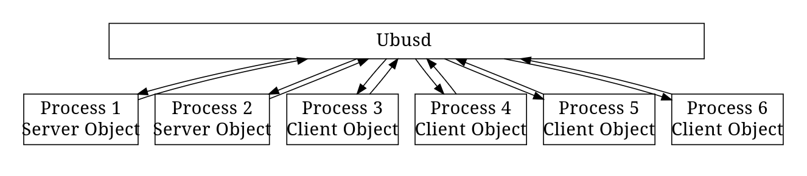
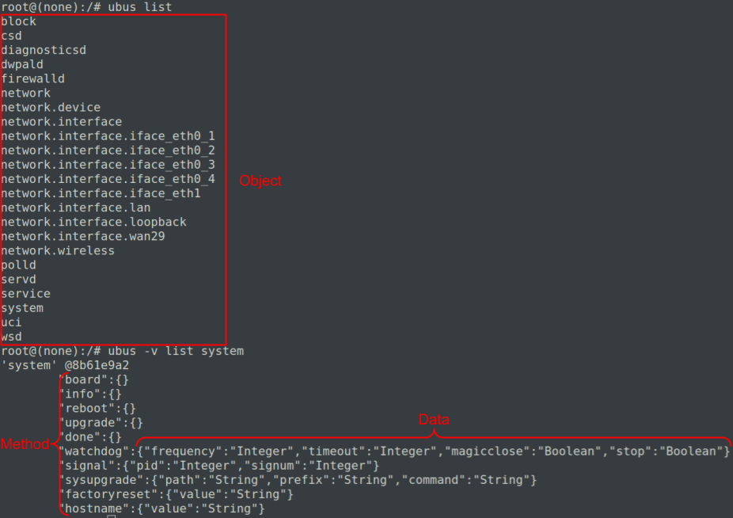
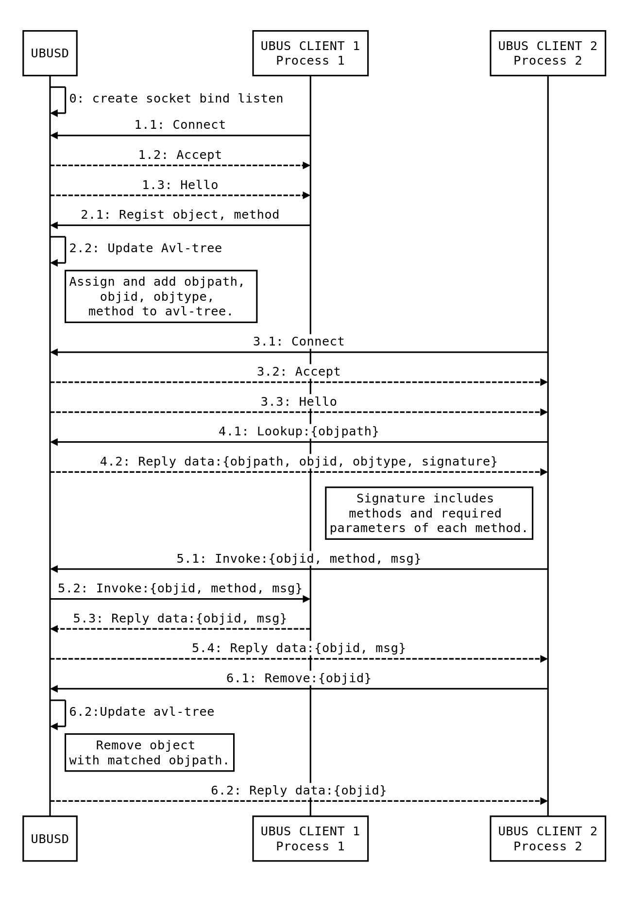
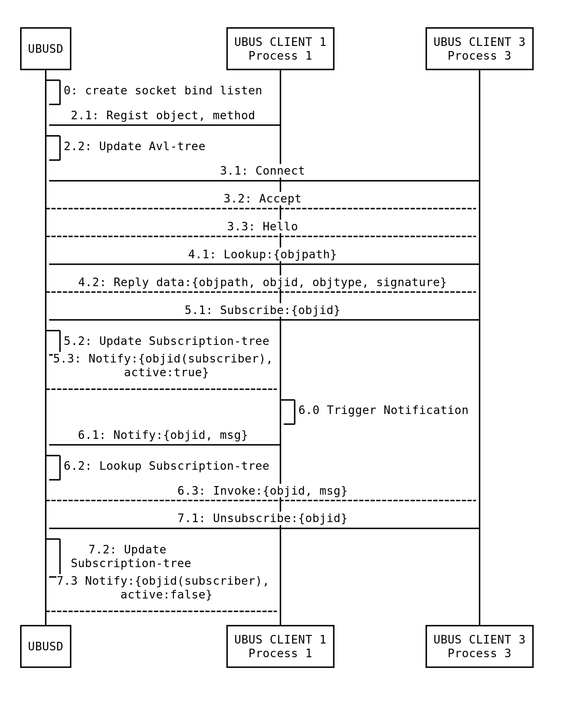
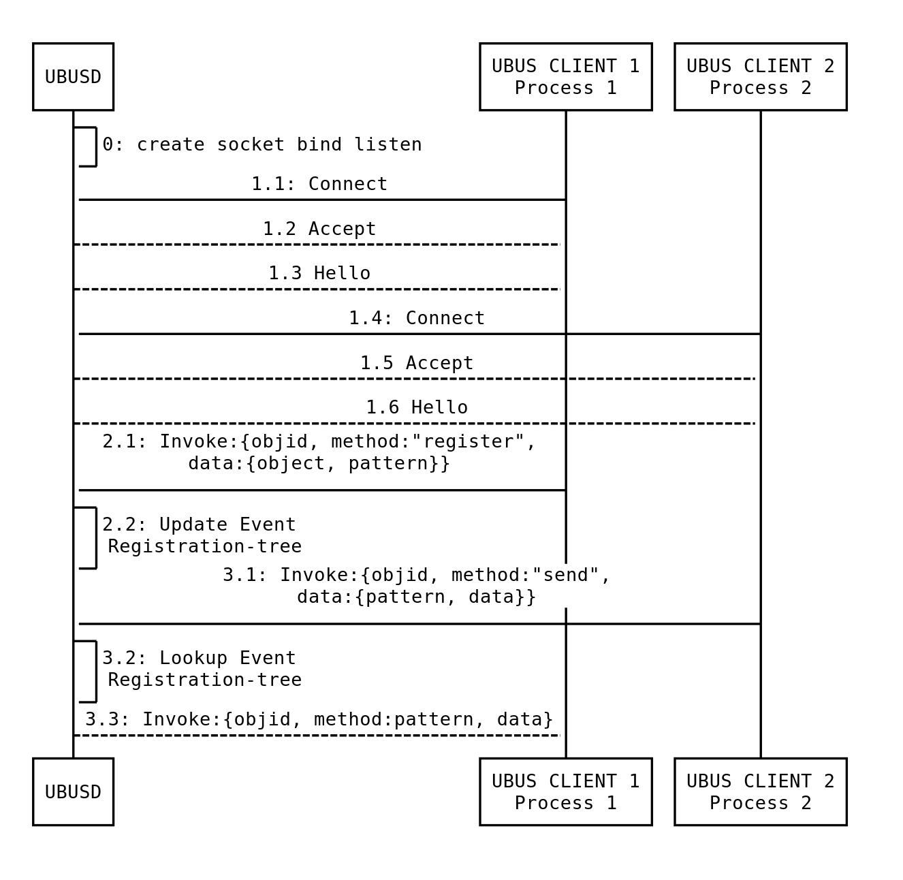

# OpenWRT

## 1. Build system cơ bản
**Build system** là tập hợp các Makefile và các Patch được nhà sản xuất thiết kế để tự động hóa toàn bộ quá trình build 1 firmware hoàn chỉnh cho router. Hệ thống thực hiện các bước:
- Tạo 1 **cross-compiler toolchain**
- Dùng toolchain đó để compile **Linux kernel**, **root filesystem**...

### 1.1 Cross-compiler toolchain
Thông thường, khi lập trình trên máy tính, việc build và run đều chạy trên máy tính đó. Tuy nhiên với router hoặc các thiết bị nhúng khác sử dụng kiến trúc CPU hoàn toàn khác.

=> Sử dụng **cross-compiler** để build firmware trên máy tính và run trên router. Để làm được thì cần 1 bộ công cụ đặc biệt gọi là **cross-compiler toolchain**, bao gồm:
- Compiler (GCC)
- Các tiện ích binary (Assembler, Linker)
- Thư viện C chuẩn (glibc)

### 1.2 Cấu trúc thư mục (lúc chưa build)
Source code để build từ repo chính thức của OpenWRT gồm 7 folder, trong đó có 4 folder phục vụ cho **build system**:
- **/config**: chứa các file cấu hình cho **menuconfig**
- **/include**: chứa các tệp dạng **.mk** định nghĩa các hàm và quy chắc chung. Các Makefile của toàn bộ hệ thống sử dụng các **.mk** này để sử dụng lại các logic chung. (giống các header file trong source C file)
- **/package - BS**: chứa các **recipe nấu ăn** để nấu các gói phần mềm như **luci, htop, openssl, wget...** Mỗi  thư mục con tương ứng với 1 gói phần mềm. Hầu hết mọi thành phần trong firmware OpenWRT đều đóng gói dạng **.ipk**
- **/script**: chứa các script dạng **.sh, .py, .per** để cho phép người dùng tải hoặc cập nhật các package
- **/target - BS**: đây là thư mục cực kỳ quan trọng, chứa mọi thứ liên quan đến phần cứng cụ thể (router) mà bạn muốn build firmware:
    - **/linux**: chứa các cấu hình kernel và các bản vá **.patch** cần thiết để kernel Linux có thể hoạt động trên phần cứng đó.
    - **/image**: chứa các Makefile mô tả quy trình đống gói các thành phần đã biên dịch (kernel, rootfs) thành 1 tệp firmware hoàn chỉnh với định dạng đúng cho thiết bị.
- **/toolchain - BS**: chứa các Makefile để build bộ **cross-compiler toolchain** bao gồm Compiler, C library, Binary utilities.
- **/tools - BS**: chứa các Makefile để build các công cụ cần thiết trên máy build như các tiện ích để xây dựng **toolchain** và các **package**, các công cụ để tạo **image firmware**. Bằng cách tự build các công cụ này, **OpenWRT** không phụ thuộc vào các ver sẵn có trên các **Linux distro** khác nhau => tránh lỗi không tương thích.

## 2. OpenWrt Feeds
Trong OpenWrt, **feeds** là kho lưu trữ các công thức build (**build recipes**) cho các package được định nghĩa trước cho **OpenWrt Buildroot**, cung cấp các package bổ sung cho **Build system** của OpenWrt.
### 2.1 Cấu hình bằng feed
OpenWrt sử dụng file cấu hình cho feeds là "**feeds.conf**" và "**feeds.conf.default**". Mỗi feed được định nghĩa trên 1 dòng riêng với 3 thành phần cách nhau bởi khoảng trắng:
```
<phương_thức_feed> <tên_feed> <nguồn_feed>
```

Dưới đây là file "**feeds.conf.default**" trong github repo chính thức của OpenWrt:

```bash
src-git packages https://git.openwrt.org/feed/packages.git
src-git luci https://git.openwrt.org/project/luci.git
src-git routing https://git.openwrt.org/feed/routing.git
src-git telephony https://git.openwrt.org/feed/telephony.git
src-git video https://github.com/openwrt/video.git
#src-git targets https://github.com/openwrt/targets.git
#src-git oldpackages http://git.openwrt.org/packages.git
#src-link custom /usr/src/openwrt/custom-feed
```

#### OpenWrt hỗ trợ nhiều phương thức tải feed:
| Phương thức | Chức năng |
| :-- | :-- |
| `src-bzr` | Tải dữ liệu bằng bzr |
| `src-cpy` | Copy dữ liệu từ đường dẫn (tương đối hoặc tuyệt đối) |
| `src-darcs` | Tải dữ liệu bằng darcs |
| `src-git` | Tải dữ liệu bằng git (shallow clone, depth=1) |
| `src-git-full` | Tải dữ liệu bằng git (full clone) |
| `src-gitsvn` | Hoạt động hai chiều giữa SVN và git |
| `src-hg` | Tải dữ liệu bằng mercurial (hg) |
| `src-link` | Tạo symlink đến đường dẫn tuyệt đối |
| `src-svn` | Tải dữ liệu bằng subversion |

### 2.2 Cách feed làm việc
Feeds được truy xuất và quản lý bởi `scripts/feeds`, nơi tổng hợp các package từ nhiều nguồn trong **OpenWrt Build System**. Có 2 bước để dev xử lý trước khi build image:
#### Step 1: Update
```bash
./scripts/feeds update -a
```

Chức năng:
- Tải feeds từ các nguồn được liệt kê trong feed configuration
- Copy vào thư mục feeds/
- Tạo cấu trúc: feeds/<feed_name>/<package_name>/
- Lưu ý: Gói chưa được tích hợp vào build system (chưa có trong package/)

#### Step 2: Install
```bash
./scripts/feeds install -a
```

Chức năng:
- Tạo symbolic links từ feeds vào package/feeds/<feed_name>/
- Sau bước này có thể thực hiện các thao tác make cụ thể:
```bash
make package/feeds/<feed_name>/<package_name>
```

#### Ngoài ra còn có các lệnh khác trong `scripts/feeds`
```bash
$ ./scripts/feeds 
Usage: ./scripts/feeds <command> [options]

Commands:
	list [options]: List feeds, their content and revisions (if installed)
	Options:
	    -n :            List of feed names.
	    -s :            List of feed names and their URL.
	    -r <feedname>:  List packages of specified feed.
	    -d <delimiter>: Use specified delimiter to distinguish rows (default: spaces)
	    -f :            List feeds in feeds.conf compatible format (when using -s).

	install [options] <package>: Install a package
	Options:
	    -a :           Install all packages from all feeds or from the specified feed using the -p option.
	    -p <feedname>: Prefer this feed when installing packages.
	    -d <y|m|n>:    Set default for newly installed packages.
	    -f :           Install will be forced even if the package exists in core OpenWrt (override)

	search [options] <substring>: Search for a package
	Options:
	    -r <feedname>: Only search in this feed

	uninstall -a|<package>: Uninstall a package
	Options:
	    -a :           Uninstalls all packages.

	update -a|<feedname(s)>: Update packages and lists of feeds in feeds.conf .
	Options:
	    -a :           Update all feeds listed within feeds.conf. Otherwise the specified feeds will be updated.
	    -i :           Recreate the index only. No feed update from repository is performed.
	    -f :           Force updating feeds even if there are changed, uncommitted files.

	clean:             Remove downloaded/generated files.
```

## 3. Các thư mục được tạo ra trong quá trình Build System
### 3.1 Thư mục `tmp/`
Được tạo ra tự động từ đầu, ngay khi config hoặc build bất kỳ gì. Vai trò của nó để lưu trữ tạm thời các file cache và 1 số info khác => giúp tăng tốc build.

### 3.2 Thư mục `feeds/`
Trong `package/` chỉ chứa 1 số `core-package` để đảm bảo hệ thống có thể build tối thiểu. Tại `feeds/` mới là nơi chứa toàn bộ hàng nghìn recipe cho các package mở rộng. Ví dụ như `feeds/packages/`, `feeds/luci/`, `feeds/routing/`, `feeds/telepony/` sẽ chứa các recipe được tải/cập nhật về `feeds/` từ các repo được khai báo trong file `feeds.conf.default`. Được cập nhật và tải về qua 2 cmd:

```
./scripts/feeds update -a
./scripts/feeds install -a
```
### 3.3 Thư mục `dl/`
Được tạo khi chạy `make download`, nơi lưu trữ (cache) tất cả các source code của kernel, toolchain và package mà mình sẽ compile trong quá trình **Build system**. Bên trong `dl` là các file nén (**.taz.gz, .taz.xz**) chứa source code. Khác với `feed/` ở chỗ, `dl/` chứa **nguyên liệu thô** `feed/` chứa **hướng dẫn sử dụng nguyên liệu thô** đó.

### 3.4 Thư mục `build_dir/`
Được tạo ra khi bắt đầu quá trình compile **host/target/toolchain**. Đây là nơi giải nén, patch, config, compile các source code trong OpenWrt (host, toolchain và target). Trong `build_dir` có các thư mục con:
- Thư mục `build_dir/host`: được tạo ra bởi lệnh
```bash
make tools/compile
```
hoặc khi `make world` bước vào giai đoạn `prepare` (build tool) để build các công cụ cho máy host.
- Thư mục `build_dir/toolchain-*`: được tạo bởi lệnh
```bash
make toolchain/compile
```
hoặc khi `make world` bước vào giai đoạn `prepare` (build toolchain) để build cross-toolchain.
- Thư mục `build_dir/target-*`: được tạo bởi lệnh
```bash
make target/compile
make package/compile
```
hoặc khi `make world` bước vào giai đoạn sau `prepare` để build kernel, rootfs, các package cho **target system**.


### 3.5 Thư mục `staging_dir/`
Được tạo song song với `build_dir/`, nơi tập kết và tổ chức tất cả các sản phẩm đã build xong, sẵn sàng cho các bước tiếp theo trong quá trình build hoặc đóng gói.
### 3.6 Thư mục `bin/`
Được tạo ra sau cùng, chỉ khi build thành công firmware cuối dùng (`make world`). Chứa **firmware images** và **package repository** (.ipk files)
### 3.7 Các file key
Gồm các file như `key-build`, `key-build.pub`, `key-build.ucert`, `key-build.ucert.revoke`


## 4. Các bước để Build System
### Bước 1: Setup và Configuration basic
```bash
# Clone source code
git clone https://git.openwrt.org/openwrt/openwrt.git
cd openwrt
git checkout openwrt-21.02

# Update feeds
./scripts/feeds update -a
./scripts/feeds install -a
```
**Kết quả**: Tạo thư mục `feeds/` chứa metadata các package.

### Bước 2: Configuration target
```bash
# Configure target
make menuconfig 
```
Được định nghĩa trong `include/toplevel.mk`, khi chạy lệnh sẽ mở ra **Build System Configuration Interface**, một số yêu cầu cấu hình:
- Target System
- Subtarget
- Target Profile
- Package selection
- Build system settings
- Kernel modules

**Kết quả**: File `.config` được tạo với cấu hình build. Tạo thư mục `tmp/`

### Bước 3: Build Process
```bash
make defconfig download clean world
```
Dưới đây là chi tiết quy trình build
#### Phase 3.1: Update, dowload và clean
- `make defconfig`: Được định nghĩa trong `include/toplevel.mk`, phục vụ cho việc tạo hoặc update `.config` file dựa trên **default configuration (defconfig)** cho **target** đã chọn (điền tùy chọn còn thiếu và gỡ bỏ mục đã lỗi thời). Ở đây `tmp/` được mở rộng. => Hoàn thành việc Configuration.
- `make download`: Được định nghĩa trong `include/toplevel.mk`, dùng để tải tất cả source code (**kernel, toolchain, packages**) về thư mục `dl/` trước khi compile => giúp mình có thể build ngoại tuyến. Tại đây `dl/` được tạo.
- `make clean`: Được định nghĩa trong **root Makefile**, sử dụng để xóa toàn bộ sản phẩm đã compile cũ (`bin/`, `build_dir/`...) nhưng giữ lại toolchain và `dl/` => là bước dọn dẹp để đảm bảo build mới không dùng nhầm cái cũ.

#### Phase 3.2: Build
```bash
make world
``` 
Được định nghĩa trong **root Makefile**, sử dụng để compile trọn vẹn firmware. Trong `make world` cũng bao gồm các giai đoạn:

**3.2.1: Compile tools và toolchain (`prepare`)**:
- Build Host Tools:
	```bash
	make tools/compile
	```
	**Kết quả tạo**:
	- `build_dir/host/`: Thư mục các tools đã compile. Ví dụ như `cmake/`, `python3/`...
	- `staging_dir/host/`: Thư mục các tools đã được install. Ví dụ như `bin/cmake`, `bin/python3/`...

- Build Cross-Toolchain:
	```bash
	make toolchain/compile
	```
	**Kết quả tạo**:
	- `build_dir/toolchain-*/`: Thư mục các cross-compiler đã compile.
	- `staging_dir/toolchain-*/`: Thư mục các cross-compiler đã install.

**3.2.2: Compile target và package**
```bash
make target/compile
make package/compile
```
**Kết quả tạo**:
- `build_dir/target-*/`: Thư mục kernel và package đã compile.
- `staging_dir/target-*/`: Thư mục kernel và package đã install.

**3.2.3: Assembly và Packaging**
```bash
make package/install # Dùng để assemble rootfs từ staged components
make target/install # Dùng để tạo firmware images từ rootfs
make package/index
```

**Kết quả tạo**:
- `bin/target`: Firmware images (.bin files)
- `bin/package`: Package repository (.ipk files + index)

## 5. Upgrading OpenWrt firmware
### 5.1 Upgrading using CLI
Thiết bị phải được cài đặt OpenWrt firmware cũ hơn để đủ điều kiện áp dụng quy trình **sysupgrade** này.

Ở đây, em tự build firmware từ source repo của OpenWrt. Sau khi build thành công, firmware image nằm trong thư mục `bin/targets/{target_system}/{subtarget}` có dạng file `*-sysupgrade.bin`. Quy trình nạp firmware cụ thể trên board AP 6 Mediatek Ramips MT7620 em sử dụng SSH tới AP thông qua CLI. Chuẩn bị phần cứng:
- Dây Console Serial: Điều khiển AP trực tiếp.
- Dây Ethernet: Truyền file firmware qua SCP.
- Dây nguồn: Cấp điện cho cho AP.

**1. Lệnh SCP**
```bash
# Copy file firmware từ máy tính local tới AP qua SSH
scp -O -P XXX abc-sysupgrade.bin root@ip_target:/tmp
```
Phân tích tham số:
- `scp`: Secure Copy Protocol - công cụ copy file qua SSH
- `-0`: Sử dụng protocol SCP cũ (legacy) thay vì SFTP mới (mặc định), vì một số thiết bị không hỗ trợ đầy đủ SFTP
- `-P XXX`: Kết nối SSH qua port 62222 (thay vì port 22 mặc định) => giúp bảo mật hơn
- `abc-sysupgrade.bin`: File firmware nguồn sau khi build
- `root@ip_target`: Đăng nhập user root trên IP 192.168.2.1 (IP của AP)
- `:/tmp`: Thư mục đích trên AP để lưu file

**2. Lệnh Minicom**
```bash
# Kết nối Serial console để điều khiển AP trực tiếp
sudo minicom -b 115200 -D /dev/ttyUSB0
```
Phân tích tham số:
- `sudo`: Chạy với quyền admin
- `minicom`: Công cụ terminal emulator cho serial
- `-b 115200`: Baudrate 115200 bps (tốc độ truyền dữ liệu serial), tùy thuộc vào loại thiết bị sẽ có baudrate khác nhau, chọn sai baudrate sẽ ra toàn ký tự lạ.
- `-D /dev/ttyUSB0`: Device file của USB-to-Serial adapter. Khi cắp USB-to-Serial apdapter, Linux tự động tạo device file.

**3. Các lệnh thực hiện trên AP**

Sau khi kết nối với AP thành công, em thực hiện lệnh trên AP như sau:
```bash
root@abc:~# cd /tmp/ # Vào thư mục lưu file tạm thời vừa copy
root@abc:/tmp# sysupgrade openwrt-ath79-generic-8dev_carambola2-squashfs-sysupgrade.bin #
```
Xảy ra lỗi:
```text
=> Thu Jan  1 07:25:04 +07 1970 upgrade: Device mediatek,mt7981-spim-snand-gsw-rfb not supported by this image
Thu Jan  1 07:25:04 +07 1970 upgrade: Supported devices: 8dev,carambola2 carambola2
sh: out of range
Invalid image type.
Image check failed.
```

=> AP hiện tại em dùng là `mediatek, mt7981-spim-snand-gsw-rfb`, mà firmware để nạp là dành cho `8dev,carambola2 carambola2`. Em tìm target khác thì không có đúng của loại AP hiện tại. Em có hỏi các anh thì các anh bảo do thiết bị của bên mình một số metadata riêng nên không dùng được như thế với lại con AP 6 bị sao ý ạ nma em quên mất lý do :>, rồi bảo em build lại thử trên con AP 5 xem thế nào, em đã build lại nhưng em chưa nạp thử ạ.

### 5.2 Upgrading using LuCI
Em chưa tìm hiểu phần này. Tài liệu sẽ tìm hiểu nằm ở cre: https://openwrt.org/docs/guide-quick-start/sysupgrade.luci

## 6. UCI system (Unified Configuration Interface)
**UCI** là hệ thống cấu hình trung tâm cho tất cả các dịch vụ OpenWrt bao gồm **Network settings, Wireless configuration, Firewall rules, System services, Package configurations...**
### 6.1 Nguyên tắc chung
Cấu hình trung tâm của OpenWrt gồm nhiều file nằm trong thư mục `/etc/config/`, mỗi file liên quan tới phần của hệ thống nó cấu hình. Có thể sửa config file bằng **text editor** hoặc dùng **CLI** của `uci`.

Khi sửa config file, các dịch vụ bị ảnh hưởng phải được restart bằng lệnh `init.d` call. `Init.d` là thư mục chứa các **script khởi động và quản lý dịch vụ** trong OpenWrt:
```text
/etc/init.d/
├── network      # Script quản lý mạng
├── wireless     # Script quản lý Wi-Fi  
├── firewall     # Script quản lý tường lửa
├── dnsmasq      # Script quản lý DNS/DHCP
├── dropbear     # Script quản lý SSH server
└── ...          # Và nhiều script khác
```
**Init.d scripts** có vai trò như **thông dịch viên**:
- Đọc **UCI config** từ `/etc/config/`
- Chuyển đổi **UCI config** thành format mà **daemon** hiểu được
- Start/stop/restart/reload/... các dịch vụ

Một ví dụ về việc thay đổi **UCI config**, giả sử muốn thay đổi port của HTTP server từ 80 thành 8080, chúng ta thay đổi cấu hình trong file `etc/config/uhttpd`:
```bash
uci set uhttpd.main.listen_http='8080'
uci commit uhttpd
/etc/init.d/uhttpd restart
```

### 6.2 Các config file
Docs chính thức của OpenWrt em thấy có liệt kê hơn 60 config file khác nhay trong `/etc/config/`. Dưới đây là 1 số file cơ bản:
```text
/etc/config/
├── network      # Cấu hình mạng
├── wireless     # Cấu hình Wi-Fi  
├── firewall     # Cấu hình tường lửa
├── dnsmasq      # Cấu hình DNS/DHCP
└── ...          # Và nhiều config file
```

### 6.3 Cấu trúc các config file
Gồm 1 hoặc nhiều `config`, còn gọi là section:
```bash
package 'example'                             # Tên gói cấu hình
 
config 'example' 'test'                       # Bắt đầu 1 section
        option   'string'      'some value'   # Định nghĩa tùy chọn đơn
        option   'boolean'     '1'
        list     'collection'  'first item'   # Định nghĩa danh sách nhiều giá trị
        list     'collection'  'second item'
```

### 6.4 Cú pháp lệnh sử dụng uci
```bash
# uci
Usage: uci [<options>] <command> [<arguments>]

Commands:
	batch
	export     [<config>]
	import     [<config>]
	changes    [<config>]
	commit     [<config>]
	add        <config> <section-type>
	add_list   <config>.<section>.<option>=<string>
	del_list   <config>.<section>.<option>=<string>
	show       [<config>[.<section>[.<option>]]]
	get        <config>.<section>[.<option>]
	set        <config>.<section>[.<option>]=<value>
	delete     <config>.<section>[.<option>]
	rename     <config>.<section>[.<option>]=<name>
	revert     <config>[.<section>[.<option>]]
	reorder    <config>.<section>=<position>

Options:
	-c <path>  set the search path for config files (default: /etc/config)
	-d <str>   set the delimiter for list values in uci show
	-f <file>  use <file> as input instead of stdin
	-m         when importing, merge data into an existing package
	-n         name unnamed sections on export (default)
	-N         don't name unnamed sections
	-p <path>  add a search path for config change files
	-P <path>  add a search path for config change files and use as default
	-q         quiet mode (don't print error messages)
	-s         force strict mode (stop on parser errors, default)
	-S         disable strict mode
	-X         do not use extended syntax on 'show'
```

Trong đó,
- **config**: nhóm cấu hình chính như **network, system, firewall**. mỗi nhóm cấu hình sở hửu 1 file trong `etc/config/`.
- **sections**: mỗi config file chia thành nhiều section. Mỗi section có thể **có tên** hoặc **không có tên**.
- **types**: mỗi section có thể có type. Ví dụ **network config** có 4 section của type **interface** đó là **lan**, **wan**, **loopback**, **wan6**.
- **options**: mỗi section có một số option, nơi mình sẽ cấu hình giá trị.
- **values**: giá trị của option.

## 7. UBUS system (OpenWrt Micro Bus)
**UBUS** là hệ thống **IPC** cho phép các daemon và ứng dụng trong OpenWrt giao tiếp với nhau, Ubus bao gồm nhiều phần:
- **ubusd**: là daemon trung tâm (broker) của toàn bộ hệ thống UBUS. Nó như 1 broker - cung cấp 1 interface cho các daemon khác đăng ký vào nó để gửi tin nhắn. Interface này triển khai bằng cách sử dụng **Unix sockets** và sử dụng các **TLV messages**.
- **libubus**: là client libarary đơn giản hóa việc phát triển phần mềm bằng ubus, cho phép apps và daemons kết nối và tương tác với ubusd
- **Unix sockets**: thay vì sử dụng TCP/UDP socket để tối ưu hóa trong cùng 1 hệ thống

### 7.1 Connection model of UBUS
Ubus sử dụng broker pattern làm kiến trúc của nó. Có 3 thành phần để thực hiện IPC thông qua Ubus:
- **ubus daemon**: Là broker nằm giữa **ubus server object** và **ubus client object**, dùng để quản lý các registration và forwards messages giữa server và client object.
- **ubus server object**: thường là interface/daemon của phần mềm nào đó. Đăng ký với **ubus daemon** với các methods (procedures) được cung cấp cho client. Server objects và các methods đã đăng ký có thể được tra cứu và gọi bởi client methods.
- **ubus client object**: Người gọi của server objects và methods.



## 7.2 Roles in UBUS
 Có nhiều vai trò khác nhau trong các quy trình IPC của Ubus:
- **Object**: Process đăng ký với ubusd, bao gồm service và service callers.
- **Method**: Procedure được cung cấp bởi objects. Object có thể cung cấp nhiều methods khác nhau như một server.
- **Data**: Thông tin ở định dạng JSON được mang bởi request hoặc reply.

```text
ubus/
├── Object_1      
|   ├── Method_1 
|	|	├── Data_1_interger   
|	|	├── Data_2_bool
|	|	└── Data_3_string        
|   ├── Method_2
|	|	└── Data_1_interger   
|   └── Method_3
├── Object_2     
└── Object_3      
    └── Method_1 
		└── Data_1_interger   
```

Ví dụ về danh sách object trên Ubus, methods và data signature liên quan của `system`:



Bên cạnh đó, có 3 vai trò khác trong Ubus:
- **Subscriber**: Object đăng ký với target service object. Subscribers sẽ được thông báo khi target service gửi notification đến ubusd.
- **Event**: Event trong Ubus được xác định bởi một chuỗi gọi là `event pattern`. Event có thể được đăng ký bởi object. Object có thể gửi dữ liệu đến ubusd với event pattern.
- **Event registrant**: Object đăng ký với event có `event pattern`. Ubusd chuyển tiếp dữ liệu đến event registrant khi nhận được tin nhắn với `event pattern` khớp.

### 7.3 Approaches of data flow sequence of UBUS
Có 3 loại sơ đồ truyền dữ liệu để triển khai IPC trong Ubus:
- **Invoke (One-to-one)**: Gửi dữ liệu hoặc requests đến object cụ thể.


Data flow của invoke:
- 0. Khởi động UBUS
- 1. Thiết lập kết nối của Process 1
- 2. Đăng ký Process 1 object với method được cung cấp
- 3. Thiết lập kết nối của Process 2
- 4. Tra cứu object id
- 5. Request với object id, method, và dữ liệu cần thiết (msg)
- 6. Hủy đăng ký object



- **Subcribe/Notify (One-to-many)**: Gửi dữ liệu đến nhiều subscribers đã đăng ký cùng object.


Data flow của invoke:
- 0. Khởi động UBUS
- 1. Thiết lập kết nối của Process 1
- 2. Đăng ký Process 1 object với method được cung cấp
- 3. Thiết lập kết nối của Process 2
- 4. Tra cứu object id
- 5. Client 3 subscribe với object id
- 7. Quá trình notification
- 8. Client 3 unsubscribe với object id



- **Event boardcast (One-to-many)**: Gửi dữ liệu đến nhiều listeners của cùng `event pattern`


Data flow của invoke:
- 0. Khởi động UBUS
- 1. Thiết lập kết nối
- 2. Receivers đăng ký với ubus event handler(objid:1) với event pattern quan tâm
- 3. Sender gửi dữ liệu đến ubus event handler(objid:1) với event pattern. Ubus event handler broadcast dữ liệu đến receivers đã đăng ký với cùng event pattern.



#### 7.4 UBUS tools
OpenWrt cung cấp 3 công cụ để truy cập ubus
- Command-line ubus tool
- C library libubus
- Ubus Lua module

**Command-line ubus tool**

Dưới đây là giải thích về các lệnh của nó:

```bash
# ubus
Usage: ubus [<options>] <command> [arguments...]
Options:
 -s <socket>:           #Set the unix domain socket to connect to
 -t <timeout>:          #Set the timeout (in seconds) for a command to complete
 -S:                    #Use simplified output (for scripts)
 -v:                    #More verbose output
 -m <type>:             #(for monitor): include a specific message type
                        #(can be used more than once)
 -M <r|t>               #(for monitor): only capture received or transmitted traffic

Commands:
 - list [<path>]                        #List objects
 - call <path> <method> [<message>]     #Call an object method
 - listen [<path>...]                   #Listen for events
 - send <type> [<message>]              #Send an event
 - wait_for <object> [<object>...]      #Wait for multiple objects to appear on ubus
 - monitor                              #Monitor ubus traffic

 ```

**Library libubus**
- Function cho object registration
- Function cho request
- Function cho subscription
- Function cho event

## 8. OpenWrt Boot Process
### 8.1 Quy trình Boot tóm tắt

1. Bootloader cấu hình đủ phần cứng cấp thấp để đọc kernel từ flash, truyền kernel command-line và nhảy vào nó.
2. Kernel khởi tạo tất cả driver phần cứng được build trực tiếp vào image.
3. Kernel mount root filesystem.
4. Kernel khởi động `init process` (PID 1) - đối với OpenWrt, init process là `procd`.
5. `procd` đọc `/etc/inittab/` và thực thi tất cả script từ `/etc/rc.d/S*`

### 8.2 Chi tiết từng giai đoạn

#### Giai đoạn 1: Bootloader

1. Bootloader trên flash được thực thi.
2. Bootloader thực hiện POST (Power-On Self Test), đây là khởi tạo phần cứng cấp thấp.
3. Bootloader giải nén Kernel image từ **flash storage** vào **main memory** (RAM).
4. Bootloader thực thi Kernel với tùy chọn `init = /etc/preinit`.

#### Giai đoạn 2: Kernel

1. Kernel tiếp tục bootstrap chính nó và thực hiện command/op-code `start_kernel`.
2. Kernel quét `mtd rootfs` partition để tìm `valid superblock` và mount `SquashFS` partition (chứa `/etc`).
3. `/etc/preinit` thiết lập pre-initialization (tạo thư mục, mount fs, `/proc`, `/sys`,...).
4. Kernel mount bất kỳ partition nào khác dưới rootfs.
5. Nếu `INITRAMFS` không được định nghĩa, gọi `/sbin/init` - mẹ của tất cả processes (**nó sẽ được thay thế bằng `/sbin/procd` sau này**).
6. Cuối cùng, một số kernel thread trở thành userspace `init` process.

#### Giai đoạn 3: Init

Userspace bắt đầu khi kernel mount rootfs và chương trình đầu tiên chạy (chương trình mặc định là `/sbin/init`).

1. Init đọc `/etc/inittab` để tìm `sysinit` entry.
2. Init gọi `/etc/init.d/rcS S boot`.
3. rcS thực thi các symlinks đến actual startup scripts nằm trong `/etc/rc.d/S##xxxxxx` với tùy chọn `start`.
4. Sau khi rcS hoàn thành, hệ thống sẽ chạy.

### 8.3 Một số scripts

**Preinit**

Preinit đưa hệ thống từ raw kernel đến sẵn sàng cho multiuser. Để làm được điều đó, nó thực hiện các tác vụ sau:

1. Sources `/etc/functions.sh` và `/lib/functions/boot.sh` cho các functions chung để boot/mount.
2. Mount các filesystems kernel thiết yếu như `procfs`.
3. Khởi tạo device tree `/dev`.
4. Khởi tạo console
5. Cung cấp cho user để vào chế độ hoạt động đặc biệt gọi là **failsafe**.
6. Mount root filesystem.
7. Trở thành `init` và chuyển vào chế độ multiuser.

**`procd`**

`procd` là daemon quản lý process mới của OpenWrt được viết bằng C. Nó theo dõi các processes khởi động từ init scripts (thông qua ubus calls). Lúc boot, Linux kernel khởi động `/sbin/init` như process người dùng đầu tiên, process này chia thành 2 bước:

- `/sbin/init` (bước preinit): partition chỉ đọc trong flashed image.
- `/sbin/procd` (bước chính): partition flash có thể ghi.

`procd` khởi động với pid 1 đảm nhận nhiều vai trò: service manager, hotplug events handler.
