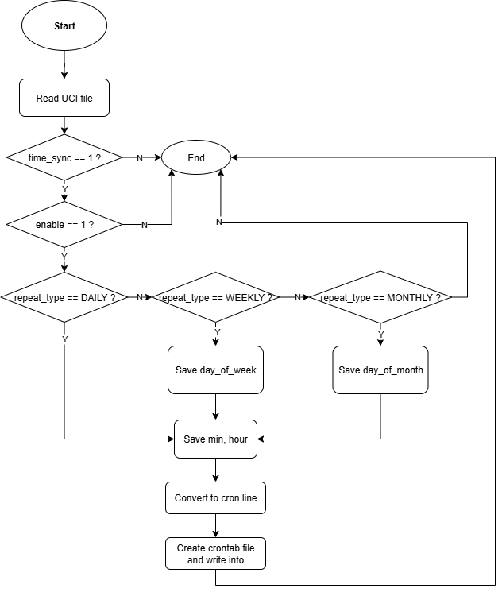

# Mục lục
- [1. Giới thiệu](#1-giới-thiệu)
- [2. Mô tả kiến trúc hệ thống](#2-mô-tả-kiến-trúc-hệ-thống)
- [3. Luồng xử lý](#3-luồng-xử-lý)
- [4. Yêu cầu khác](#4-yêu-cầu-khác)
- [5. Phụ lục](#5-phụ-lục)

---

## 1. Giới thiệu

## 2. Mô tả kiến trúc hệ thống chung
Kiến trúc phần mềm của Schedule reboot chia thành 2 phần chính: Phần giao diện người dùng (Frontend layer) và phần xử lý yêu cầu người dùng (Backend layer):


Khi user cấu hình lịch reboot trên giao diện web, 1 system trong web block sẽ thực hiện 2 action là cấu hình UCI file và reload config xuống cho Backend. Backend nhận được sự thay đổi của UCI file sẽ xử lý và lên lịch reboot cho thiết bị.
## 3. Kiến trúc của Frontend layer

## 4. Kiến trúc của Backend layer
### 4.1 Mô tả chung

### 4.2 Kiến trúc tổng quan
Kiến trúc tổng quan của Backend được xây dựng dựa trên những thành phần chính được mô tả như trong block diagram dưới đây:


### 4.3 Mô tả thành phần chi tiết
#### a. NTP system
NTP system là 1 submodule thuộc hệ thống hotplug.d, trước khi đi vào hệ thống con ntp, tôi sẽ nói sơ qua về hệ thống hotplug:

Hệ thống hotplug được tạo ra ngay tại giai đoạn `STATE_EARLY` của boot sequence, nó phục vụ việc phản ứng với các sự kiện phần cứng. Trong quá trình boot sequence, tại giai đoạn `STATE_UBUS`, procd có đăng ký hotplug object với ubus system để lắng nghe những event từ hotplug system. Trong `STATE_RUNNING`, kernel phát hiện ra event từ phần cứng, nó gọi 1 hotplug helper, helper này sẽ đóng gói thông tin từ event thành 1 chuỗi JSON và gửi nó tới ubus object tương ứng (hotplug object). Lúc này procd lắng nghe thấy event mà nó đã đăng ký từ trước, procd đưa event đó và queue, cuối cùng thực thi tất cả các script bên trong `/etc/hotplug.d/{subsystem}/...` đã được định nghĩa (hệ thống hoặc user định nghĩa). Quay trở lại với NTP system, đây là 1 subsystem trong hotplug phục vụ cho việc đồng bộ thời gian. Để thiết bị có thể đồng bộ thời gian thực, OpenWrt có hỗ trợ 1 daemon riêng xử lý việc đó, đó là `sysntpd` - daemon đồng bộ thời gian hệ thống thông qua giao thức. Trong quá trình boot, procd chạy `/etc/init.d/sysntpd` và đọc thấy `option enable_ntpd '1'` trong `/etc/config/system`, `sysntpd` sẽ được khởi động để đồng bộ thời gian thông qua các server dưới đây:

```bash
config timeserver 'ntp'
        option enabled '1'
        option enable_server '0'
        list server '2.vn.pool.ntp.org'
        list server 'vn.pool.ntp.org'
        list server 'asia.pool.ntp.org'
```

 Dưới đây là 1 block diagram mà tôi mô tả quá trình khi thiết bị nhận được sự kiện đồng bộ thời gian:


Từ sơ đồ có thể thấy rằng input của **ntp system** là event đồng bộ thời gian, output là uci file của schedule_reboot được set flag:

```bash
logger -t stratum "Capturing stratum action..."
[ "$ACTION" = "stratum" ] || exit 0

logger -t stratum "Captured stratum action"

uci set schedule_reboot.schedule_reboot.time_sync='1'
uci commit schedule_reboot
```

Flag của UCI file chỉ được set khi nhận được `action = "stratum"`

#### b. Ubus system và procd
Sau khi Web LuCI cấu hình và lưu cấu hình lại (`uci set` và `uci commit`), nó sẽ thực hiện thêm 1 action nữa đó là nó sẽ call `reload_config` xuống Backend để reload và start lại những thay đổi đã cấu hình vào UCI file. Bản chất Web LuCI gọi `reload_config` là nó sẽ phát đi 1 event tới ubus system:

```bash
reload_config() {
    uci_apply_defaults
    ubus call service event '{ "type": "config.change", "data": {} }'
}
```

Hàm này phát đi event `config.change` qua ubus system (không cần biết UCI file có thay đổi hay không, miễn là có uci commit thì nó sẽ phát event). Lúc này `procd` sẽ lắng nghe event này, khi nhận được event thì nó sẽ tra bảng trigger đã đăng ký `procd_add_reload_trigger`, trong đó service nào quan tâm thì procd sẽ xét tiếp. Trước khi gọi reload service, procd sẽ so sánh checksum (md5) lần commit cũ với mới. Nếu checksum khác nhau, procd sẽ gọi init script của service đó với action `reload`. Như vậy ta chỉ cần đăng ký hàm `procd_add_reload_trigger` với init script của `schedule_reboot` là nó sẽ tự kích hoạt hàm **reload** để chạy service.

#### c. UCI file của schedule_reboot
UCI file được thiết kế dựa theo yêu cầu chức năng reboot như dưới đây:
```bash
config schedule_reboot 'schedule_reboot'
        option enable '1'
        option repeat_type 'daily'
        list day_of_week '3'
        list day_of_week '6'
        list day_of_month '1'
        list day_of_month '10'
        option reboot_time '8:59'
        option time_sync '1'
```

#### d. Init script của schedule_reboot
Init script của schedule_reboot được thiết kế dưới quyền quản lý của procd. Dưới đây là đoạn script các hàm bên trong init script đã deploy:

**Hàm start_service()**
```bash
start_service() {
    echo "Starting schedule reboot"
    procd_open_instance
    procd_set_param command /usr/sbin/schedule_reboot
    procd_close_instance
}
```
Hàm này đóng gói các param được set trong hàm thành chuỗi JSON rồi gửi tới procd để xử lý. Ở đây, mục đích của hàm chỉ đơn giản là thực thi **Schedule reboot handler** sẽ được trình bày ở phần sau.

**Hàm reload_service()**
```bash
reload_service() {
    echo "Reloading schedule reboot"
    stop
    start
}
```
Hàm này có nhiệm vụ thực thi lại **Schedule reboot handler** mỗi khi có sự thay đổi UCI file. Hàm sẽ được procd gọi `/etc/init.d/schedule_reboot reload` sau khi trải qua giai đoạn Web LuCI gọi `reload_config` (đã được trình bày ở phần trước).

**Hàm boot()**
```bash
boot() {
    echo "Booting schedule reboot......."

    echo "Remove crontab file"
    > /etc/crontabs/root

    echo "Restarting cron service"
    /etc/init.d/cron restart

    echo "Reset time_sync"
    uci set schedule_reboot.schedule_reboot.time_sync='0'
    uci commit schedule_reboot

    start "$@"
}
```
Hàm này sẽ được thực thi ở trong giai đoạn `STATE_INIT` ngay khi boot sequence, procd đọc file cấu hình `/etc/inittab` và xử lý từng dòng trong đó. Dòng đầu tiên procd xử lý là `::sysinit:/etc/init.d/rcS S boot`, handler `sysinit` sẽ gọi hàm `runrc()` với tham số `S`. Hàm `runrc()` gọi tới `rcS()` để tìm tất cả các file trong `/etc/rc.d/` khới với pattern `S*` và gọi  các script này symlink từ `/etc/init.d`:
```c
int rcS(char *pattern, char *param, void (*q_empty)(struct runqueue *))
{
    runqueue_init(&q);
    q.empty_cb = q_empty;
    q.max_running_tasks = 1;

    return _rc(&q, "/etc/rc.d", pattern, "*", param);
}
```

Như vậy `/etc/init.d/schedule_reboot boot` sẽ được gọi ngay tại boot sequence để xử lý 1 số tác vụ là:
- Xóa crontab file cũ
- Khởi động lại crond
- Reset flag của UCI file
- Chạy service

**Hàm service_trigger()**
```bash
service_trigger() {
    procd_add_reload_trigger schedule_reboot
```
Như đã nói ở phần **Ubus system và procd**, hàm này giúp cho service **schedule_reboot** đăng ký reload với procd khi có event tương ứng (`config.change`).

#### e. Schedule_reboot handler
Dưới đây là lưu đồ thuật toán hoạt động của phần schedule reboot handler:



Phần handler cho service schedule_reboot có 3 nhiệm vụ chính:
- Đọc UCI file và lưu vào buffer
- Convert UCI file format thành crontab file format
- Tạo crontab file và ghi dữ liệu vào

Đây là cấu trúc dữ liệu để lưu thông tin sau khi convert thành crontab file format:


#### f. Cron system
Cron system là hệ thống được quản lý bởi **crond** - daemon theo dõi các crontab file và xử lý những gì ghi trong đó. Nó được `restart` mỗi lần boot thiết bị (xảy ra ở hàm `boot` trong init script). Crond sẽ duyệt toàn bộ file nằm trong `/etc/crontabs/...` và chạy tất cả chúng (mục đích sử dụng ở đây là reboot thiết bị định kỳ).

### 4.4 Luồng xử lý
#### a. Luồng boot


#### b. Luồng cấu hình reboot

## 5. Phụ lục
